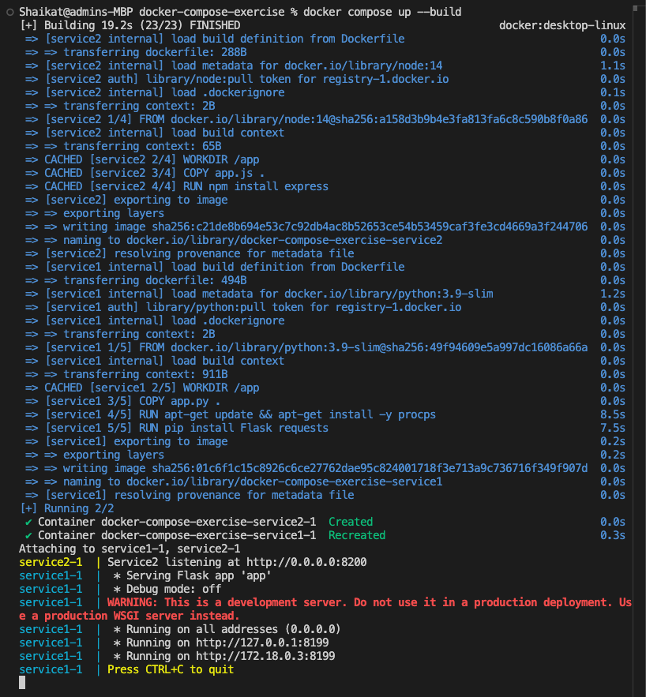
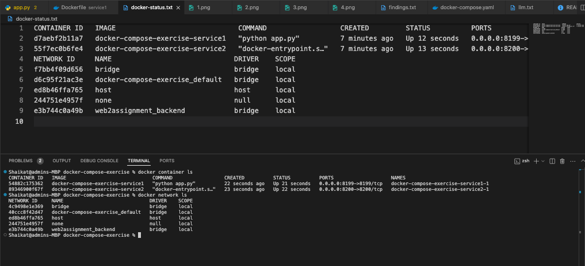
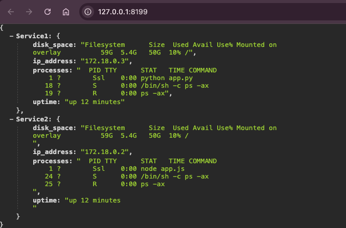
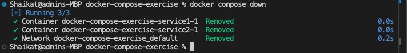
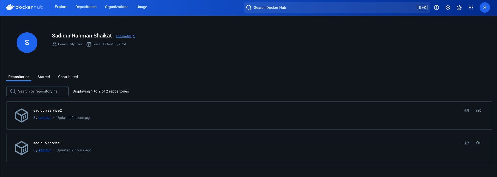

# Docker Compose Hands-On Exercise

## Overview

This project is part of the COMP.SE.140 course, designed to provide hands-on experience with Docker and Docker Compose. The goal is to create a system of two interworking services, each implemented in a different programming language, that can be started and stopped together. The services collect system information from their respective containers and communicate with each other to provide a comprehensive response to HTTP requests.

## Project Requirements

- **Two Services**: Implement two services (Service1 and Service2) in different programming languages (excluding shell script and HTML).
- **System Information**: Each service should collect the following information from its container:
  - IP address
  - Running processes
  - Available disk space in the root filesystem
  - Time since last boot
- **Communication**: Service1 acts as an HTTP server on port 8199 and communicates with Service2 to gather its information.
- **Output Format**: The response should be in JSON format, including information from both services.
- **Docker Setup**: Create Dockerfiles for each service and a `docker-compose.yaml` file to manage the services.
- **Submission**: Include source code, Dockerfiles, `docker-compose.yaml`, and a text file with the output of `docker container ls` and `docker network ls` when services are running.

## Solution

### Service1

- **Language**: Python
- **Framework**: Flask
- **Dockerfile**: Builds a Python environment and runs the Flask app.

### Service2

- **Language**: JavaScript
- **Framework**: Express.js
- **Dockerfile**: Builds a Node.js environment and runs the Express app.

### Docker Compose

- **Configuration**: The `docker-compose.yaml` file defines both services, their build contexts, and networking setup.

## How to Run the Project

1. **Clone the Repository**:
   ```bash
   git clone -b exercise1 https://github.com/shaikat1993/docker-compose-service1-service2.git

2. **Build and Start the Services**:
   ```bash
   docker compose up --build
 

3. **Check the Status of the Services**:
   ```bash
   docker container ls
   docker network ls
 
   
4. **Test the Services:**:
   - Wait for approximately 10 seconds for the services to initialize.
   - Use curl to test the HTTP server:
   ```bash
   curl localhost:8199
  

- To stop the server: 
  ```bash
   press Ctrl+C
 
  
5. **Stop the Services**:
   ```bash
   docker compose down
  
### Additional task:
## Continuous Integration and Deployment
In this project, we have established a Continuous Integration and Deployment (CI/CD) pipeline utilizing GitHub Actions . This pipeline is designed to automate the process of building Docker images for our services and subsequently pushing them to [Docker Hub](https://hub.docker.com/u/sadidur). This automation is triggered whenever changes are committed to specified branches within our repository.


### GitHub Actions Workflow

The workflow is triggered on pushes to the `main` and `exercise1` branches. It performs the following steps:

1. **Checkout Code**: The workflow checks out the code from the repository to ensure it has the latest version of the application.

2. **Set up Docker Buildx**: This step sets up [Docker Buildx](https://docs.docker.com/buildx/working-with-buildx/), a tool that provides extended capabilities with Docker, such as building multi-platform images.

3. **Log in to Docker Hub**: The workflow logs into Docker Hub using credentials stored as GitHub secrets (`DOCKER_USERNAME` and `DOCKER_PASSWORD`). This ensures secure access to Docker Hub for pushing images.

4. **Build and Push Docker Images**:
   - **Service1**: The Docker image for Service1 is built from the `./service1` directory and pushed to Docker Hub with the tag `latest`.
   - **Service2**: Similarly, the Docker image for Service2 is built from the `./service2` directory and pushed to Docker Hub with the tag `latest`.

### How to Set Up GitHub Secrets

To securely store your Docker Hub credentials, you need to set up GitHub secrets in your repository:

1. Navigate to your GitHub repository.
2. Go to **Settings** > **Secrets and variables** > **Actions**.
3. Click on **New repository secret**.
4. Add `DOCKER_USERNAME` and `DOCKER_PASSWORD` with your Docker Hub credentials.

### Benefits

- **Automation**: The CI/CD pipeline automates the build and deployment process, reducing manual effort and the potential for human error.
- **Consistency**: Ensures that the Docker images are consistently built and deployed with every change, maintaining the integrity of the application across environments.
- **Speed**: Accelerates the deployment process, allowing for faster iterations and updates to the application.

By integrating this CI/CD pipeline, we enhance the robustness and reliability of our deployment process, ensuring that our services are always up-to-date and readily available on Docker Hub.
 
### Findings
- A detailed explanation of what containers share with the host system is provided in findings.txt.

### Additional Notes
- Ensure that Docker and Docker Compose are installed on your system.
- The project is designed to be tested on a Linux environment.
- Follow good programming and Docker practices as outlined in the course guidelines.

### LLM Usage
- A detailed explanation is added in llm.txt as per the course requirements.

### Conclusion
- This project demonstrates the use of Docker and Docker Compose to manage multi-service applications, highlighting the benefits of containerization and virtualization in application development.
